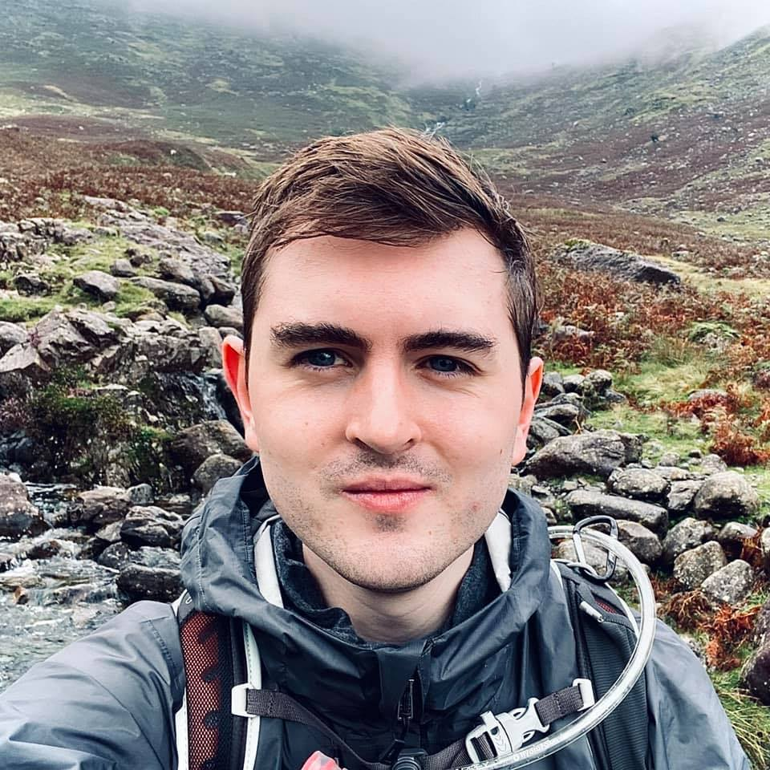
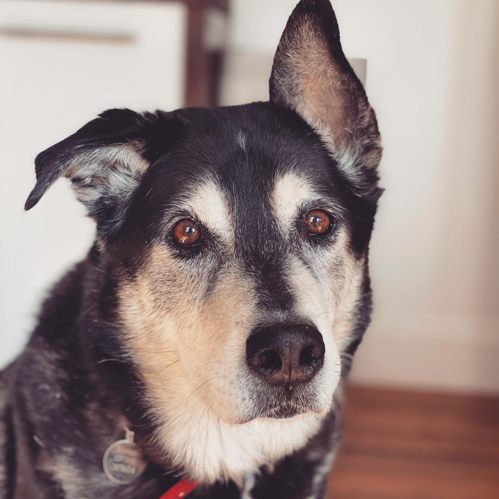

  

## About Me

 

I seem to have a drive for creativity, be that writing, music production, photography, development… the list goes on.
But I’ve always struggled to define exactly what I’m happy doing most.
The fear of falling into the trap of becoming a “Jack of all trades, master of none” has certainly brought me some levels of anxiety over the years.

It’s only recently that I’ve started to take a step back and re-evaluate what means the most to me. And here is my solution.
This is the place where I’ll be documenting my travels, adventures and self retrospection.

I've always wanted to start writing, but I’ve never seemed to get round to it.
As the years started to pass by, and my constant self-reassurance that I’d get around to it year after year,
I've finally managed to kick my own backside and finally, start writing.

### Development

By trade, I’m a Software Engineer. I love my job. I find programming to be rather therapeutic... most of the time.

_(Mum if you’re reading this, did you try turning it off and on again?)_

Having been quite an avid gamer throughout my school days, I would of never considered going on to study Software Engineering if I wasn't exposed to the technologies that games offer.
After studying Software Engineering at college, I went on to graduate in Computer Science at King’s College London.

### Music

Music has played a massive role in my life.
Having a Dad who has been playing in bands for as long as I can remember is the reason I believe I’ve been so musically driven.
It was only natural that someday I would want to follow in his footsteps and pick up the guitar; somewhere around my eighth birthday, I did.

Throughout my school days, l was in and out of bands and somewhere along the way I started exploring electronic music production.
Looking back, I had a fairly successful experience. Somehow I managed to perform overseas and even released some of my music in Japan. I did, however, have an unhealthy relationship with it all and I think the takeaway here is that when it comes to music, I much prefer being a consumer than a creator.

Maybe somewhere down the line, my path will lead me back to music.

### Photography

Now, in the era of connectivity where sharing is easier than ever, giving people inspiration and sharing moments with others is something I want to do more of.

Taking video and pictures of adventures is something that 2020 holds for me, so hopefully sometime soon, I will pick up the camera again.

### Everything Else

Outside of my hobbies, professions and everything in between I currently reside in London with my fiancé Beth, and Tonrar, our dog.

We’re both avid gamers and enjoy getting cosy on the weekends playing through whichever RPG takes our fancy.

  
  woof

---

 

_The content on this page will change over time. I’m still learning and growing as a person. Whilst this page serves as a snapshot of my inner-descriptive monologue in the ’now’, I plan to revisit here and keep this page up-to-date when I see fit. Everyone has goals and aspirations, and the world around us is constantly changing, I'd like this page to be constantly changing too._
