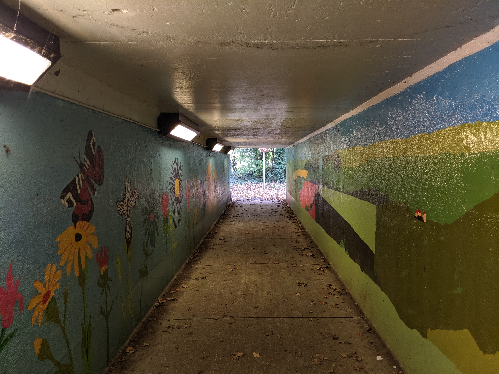
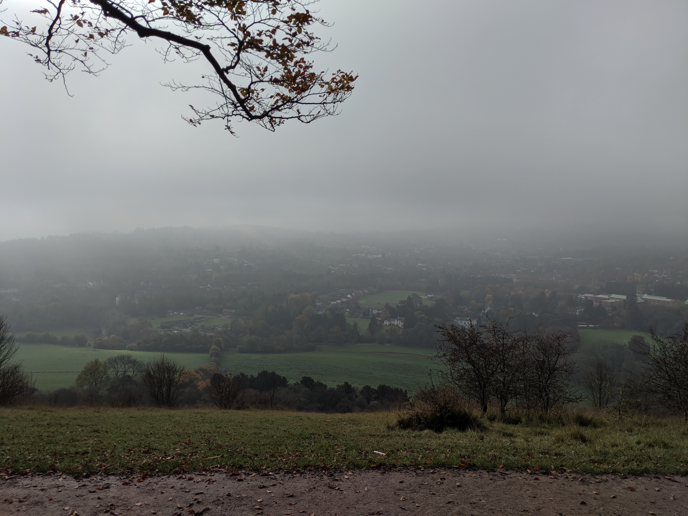
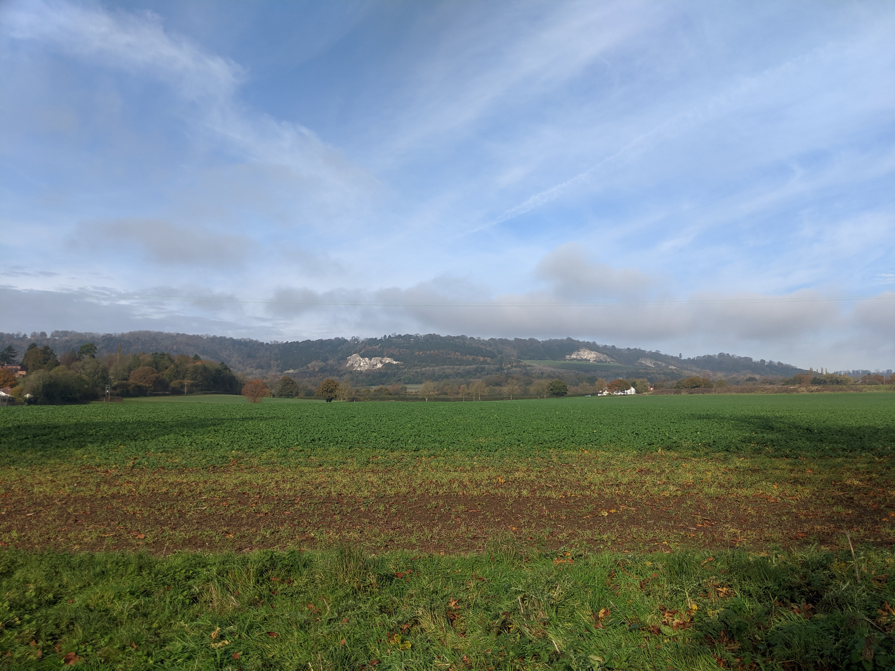
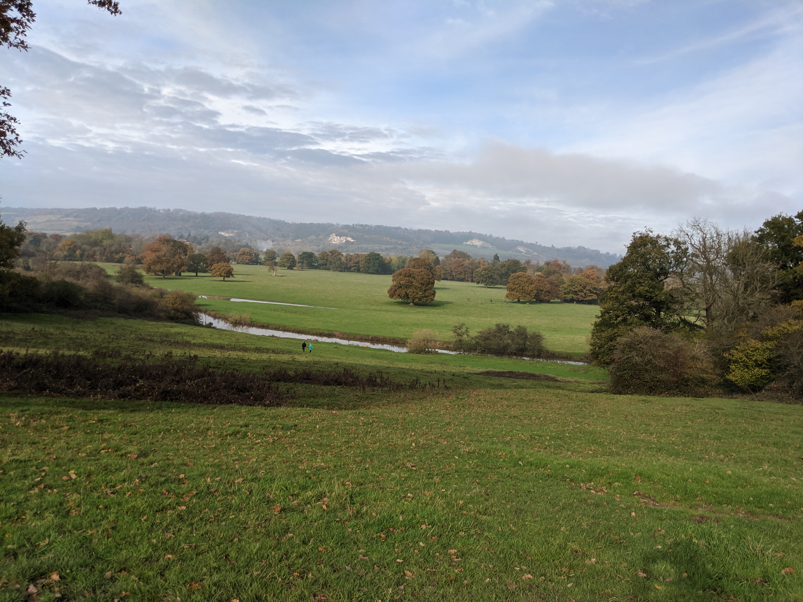

Autumnal challenge: a monster hike up and down large hillsides, 40km in total, and all of this from sunrise to sunset. _Ambitious_.

Late in 2019, I wanted to see how far I could push my limits. Having previously only completed short circular day hikes, this time I wanted it to be different, both physically and mentally - my body was ready, or so I thought.

The challenge: I set myself the goal of completing a 40km circular hike up and over Box Hill and through the surrounding area. All of this to be completed in one day: no camping and ideally, before sunset. I did some calculations and planning beforehand, and aimed to keep a pace of around 2mph, completing the circuit in just over 12 hours. In a perfect world, I’d set out around 5:30am, arrive around 7am, wrap up around 8pm and finally, arrive back home around 10pm. _Easy._

Leading up to the day I started to have a few concerns: worried that I might not pack enough provisions, carry enough water or even overestimate my pacing. It also didn’t help that this would be my first solo hike. I knew that if anything went wrong along the way, I'd have no partner to rely on, and things could turn bad, fast.

With all that said, I was all packed and ready to go!

  

I set out just before sunrise, my route took me into central London and then back out again via Waterloo station. I used to live in Waterloo back when I was studying at university and always enjoy passing through there; guess it’s the sense of nostalgia or something (this doesn’t hold for rush hour though, it then becomes the last place on Earth I’d like to be 😂).

This leads us to the first failing of the journey: the train was delayed… and when I say delayed, I mean it pulled into the station almost 30 minutes late 😭! Being on a rather ambitiously tight schedule, this didn’t do me any favours. No worries, even with the delay, I still had a bit of time to work with before sunset, and only needed a slight increase in my pacing to make up for the lost time. Luckily, the train was able to make up some time en route, ending up only arriving 20 minutes later than expected, not too bad!

  

I set off from the station towards the trailhead; which was just a short 10-minute walk away from the station. I planned to start the route via the stepping stones walk (https://www.nationaltrust.org.uk/box-hill/trails/box-hill-stepping-stones-walk). With Google maps leading the way forward, I set off! There was a rather cool looking subway that I had to pass through, that I thought served as a sentimental nod to the start of the journey that lay ahead.

_Note:_ If ever you’re looking for inspiration for a day out, or just want to discover some trails nearby, I highly suggest you check out the national trust website https://www.nationaltrust.org.uk/trails.
They have plenty of routes listed, and you can search locally using the route-finder map.

  

I knew that not only was this hike a long one, it was also going to be more difficult than your average hike because of the difference in terrain and incline. Right from the offset, there’s Box Hill to summit. I knew that reaching the top was going to take _a lot_ of energy out of me, which in turn was going to mean lower energy levels for the rest of the journey.
With all that said, I arrived at the trailhead; having just commuted via Central London, it was rather pleasant to arrive at the start to find no-one. The trees and birds were my only company.

I have to say the palette of the scenery around was sublime. Being mid-Autumn, the landscape was holding onto life before Winter comes to wash it all away. Creating a harsh contrast between the yellow hues of the ground and the vibrant greens of the canopy above.

  

After a short while, I arrived at the second hurdle: the river. In hindsight, I should have probably expected what lay ahead. The river was impassable 😭; the stepping-stones completely submerged!

In all honestly, I was fairly gutted as this was one of the highlights of the route that I was looking forward to seeing, and stepping over. I stood there for a few minutes weighing up my options. How do I get to the other side? Do I attempt to cross? How deep is it? Do I really want wet boots for the rest of the journey?

In the end, I decided to be sensible and look for another route across down-stream. I did notice a fork in the path at the start of the train and thought it would be best to follow the riverbank to see where the path leads.

  

Lucky for me, after walking alongside the river bank for a few minutes I managed to spot a bridge! Thing were starting to look up, and so was I in a different sense; with the steps up Box Hill just a few yards up in front I was ready to start the climb up to the top.

I didn’t actually grab a picture of the stairway, but they seemed almost never-ending, relentless and also covered in mud… great. _I really didn’t pick a great day for, this did I?_

The ascent to the top was tough. The stairs kept coming and coming, and looking back, I should have paced myself better, but I was eager and wanted to make up some of the time that I lost on the way here. I pushed myself pretty hard and my heart felt like it was beating out of my chest. About halfway up I thought about stopping and taking a breather, but at the same time I had the goal to reach the top in mind and with that, pushed on.

  

The view from the top was, well… _disappointing._ I couldn’t have picked a worse day to go hiking. As I arrived and looked out over the pastures and villages below, I couldn’t help but have a little chuckle to myself about how depressing and miserable the landscape was. With heavy clouds weighing down from above, and all glimmer of hope that the sun would start beaming through diminishing, I knew what I had to do next… Sit down, take five minutes and tuck into a well-deserved snack.

Feeling refreshed, and with the knowledge that the only way from here was downhill, I set off. Even though the day was bleak and rather depressing, I did seem to bump into quite a few other people hiking themselves or just walking their dogs. Who doesn’t love a good bit of rain? 🌦️

_Looking back over the above photograph, I feel that it could be used as a great reference when describing British Weather._

  

The descent on a normal day would have been a relaxing stroll down, but honestly, the conditions were horrific. Sloppy mud and wet leaves below are not easy conditions to keep your footing on when coming down even the smallest of inclines. Normally, I’d be able to make a good pace going downhill, but due to the terrible conditions, I took my time. The last thing I needed is to lose my footing and injure myself here.

That leads me to a very important thing to keep in mind when you’re out and about in nature: safety first. If you start rushing, naturally the chances of injury go up. It can be going all fine and well, but an injury can quickly turn safe situations into dangerous ones, and fast. Fatigue can be another common cause of injuries. Not knowing when to stop and rest or call it a night can often lead people into not being fully aware of their situation and surroundings and leads to bad decision making.

If you’re hiking alone, always make sure you’re accessible or that someone knows where you are! If you are hiking off-grid, then a GPS tracker can be a good way to give reassurance to your loved ones about where you are. Some even come bundled with incident detection features, that can send out an SOS signal to local authorities or your loved ones if you’ve fallen over, or worse.

  

I made it up and over the other side; although my body hadn't. The aches and pains had started to set in. I think that I pushed myself too hard getting through the first section of the hike which to be honest was rather stupid given that I was hoping to cover 40km before sunset. I think the ground underfoot didn’t help the situation. I was starting to think that, given the circumstances, finishing before nightfall might be a bit unrealistic.

Longing to be back on some solid ground, I pushed onwards. Delightfully, I could see civilisation ahead and with it, some roads, paths and villages.

  

By this point, things were starting to look up. The sun had decided to come out; the clouds were clearing; I was on some decent footing and I’d already managed to complete the hardest part of the trail! I had a few small villages to navigate through before picking up the next marked path. I did think about stopping by a local pub for some lunch but, given that I was already behind schedule and still relatively early into the route, I thought better not, there’s always next time.

  

The scenery here was beautiful: completely different from the surroundings of the big city. I’m not saying I dislike cityscapes or the life that comes with it, but rather it’s nice to get out and see some of nature for a change and not spend all day behind a screen - be that a PC/Laptop or my phone.

I think being surrounded by technology can sometimes have a much more negative impact on your life than you might realise. I started to get a bit concerned when I started to see my weekly screen time report after my new phone started notifying me about my phone usage breakdown each week.

I did some research into how to improve the way I use technology and come across the book “Digital Minimalism” by Cal Newport. I seem to align with a lot of minimalist principles, but don’t actively enforce any methodology in my life. However, I think for my personal wellbeing, applying some of the teachings that I picked up from the book have dramatically improved my relationship with technology, and have also caused me to rekindle with neglected analogue hobbies that I’ve drifted from as the years have gone by. I highly suggest you pick this read up the next time you’re passing your local bookstore!

  

Along the route that I was following I stumbled upon an old wartime pillbox that had starting to merge with the nature around it. _I love spotting hidden history in the wild!_ With the fallen leaves dusting the top of the decaying brickwork, you really would think that this has been there forever. While there are quite a few pillboxes that are still standing and dotted around the country, most of them can be found near coastlines or next to cities and towns in the south, as they were built as anti-invasion measures against the German forces during the war.

  

I'd arrived at what I considered to be the halfway mark of my journey. The landscapes here were absolutely stunning and if I wasn’t in such a rush to make up the time, I would have loved to have just stopped everything, sit down and stare at the horizon a little longer.

I think the British countryside has a certain characteristic and charm to it. The colours are always consistent with the seasons and the unique backdrops that you find here are always easily identifiable. Mind you, contrary to my previous statement, you wouldn’t think that I was less than an hour away from the capital, rather that I’d just come off the set of Lord of the Rings or something.

  

I always enjoy passing through the small villages; seeing these places that have almost been locked in time in contrast to the fast-moving metropolis that I get to see daily. When hiking new routes, I usually pass by local services, pubs and churches. Whilst I’m not religious, I do like to walk through the grounds as I appreciate the history and architecture that these places offer and I think it’s an important part of our heritage.

  

Unfortunately, whilst I did manage to capture a few good shots, ultimately, I did feel a little photographically challenged at times. I have a confession: all of the pictures that you see in this post were taken with the camera on my phone (Pixel 2 at the time) as I’m currently without any photography gear. I previously owned a Canon 60D DSLR which I ended up selling as it was gathering quite a bit of dust getting little to no use. I can’t say I regret selling it, but I do think soon I’ll re-invest in some gear. We’ll see.

  

One place I didn’t expect to end up in on this hike was Japan. Tucked away behind the tree line I spotted what looked like a traditional Japanese Gateway or 鳥居 (Torii) which can typically be found scattered across Japan, usually marking the entrances to Shinto shrines. Honestly, I had to double-take when I first saw it. Residing in what looked like a rather tranquil garden that was also fenced off from the train, I decided to push through to try get as close as possible.

It was shortly after passing this that I started to notice the fading daylight, signaling that I was out of time. I had around 1 - 2 hours left to go (according to the map), and while I could have pressed on to get to the finish, it would have meant walking in the dark, through hillsides with bad conditions underfoot. I decided to put my safety first and make my way home.

Feeling a bit defeated and disappointed with myself, I reluctantly set off towards the nearest village (despite my disappointment, I knew I was making the smart decision). 15 minutes away, I managed to find a bus stop which would take me to the closest rail station, with connections to Central London.

  

Just before I departed from the route, I grabbed one final picture overlooking the landscape where I decided to end the journey. I hope (or rather), I know that in the near future, I’ll be capturing the same shot but with time on my side. With the things that I’ve learned on this journey I know I’ll complete what I initially set out to do.

I learned a lot from this challenge, and I think that’s what hiking is all about. Setting yourself goals and learning from them, overcoming challenges and also knowing how to prepare for anything. It’s what you make it, so get out there!

## Route Map

 
<Embed src="https://www.google.com/maps/d/u/0/embed?mid=1VegX_LJsd5X_22yt8iRjQQBu9c5eWxWb" />
 

## Notes

I know it’s been some time since my last post went up. I did plan to write this up sooner but instead, I’ve been reworking some parts of my site as things weren’t sitting quite right.
_(If you’re a developer yourself, the source code my site is public and available for everyone to view and download! https://www.github.com/RichFlavell/richflavell.com)_

I’m planning once the current ongoing COVID-19 situation has passed, to revisit this personal challenge and complete what I initially set out to do. By learning from my past mistakes by choosing a more practical day and by pacing myself better when I do so, I hope that I’ll be able to finally tick this one off my list - I should probably also do some training beforehand!

If you have any route or content suggestions, writing or photography critique or anything else that you might want to ask me, feel free to leave a comment and I’ll endeavour to get back to you as soon as I can 👋

 
