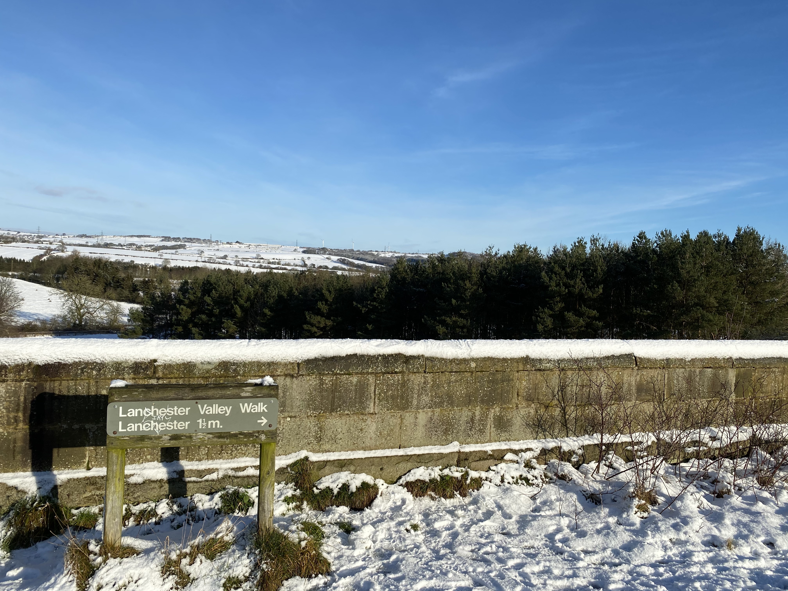

It's been some time since I last posted something on here. Since then, I've been quite busy, having moved out of London to the North East, picked up my guitar again for the first time in a long while, and even managed to attempt my first multi-day hiking challenge through the Lake District, which I'll touch on later in this post.

Meanwhile, as the fight against COVID is still ongoing in all corners of the world, we've all had to adapt to changes in our day-to-day lifestyle and I've been trying to keep active somewhat whilst lockdown is still in place.

Luckily for me, we've had a cold snap recently in the North East that inspired me to get my boots on and set out on a local trail: The Lanchester Valley Walk.

  

Because of the national restrictions, I made sure to stick to current advice and kept it local. No need to travel cross-country when there's open countryside on my doorstep - a privilege that I didn't really have when I was living in London.

After navigating a few icy roads and paths I picked up the trail - quite thankful to have snow, and not ice underfoot. We had a small flurry of snowfall a week ago which has now formed a layer of ice over the roads and paths - not fun at all!

The actual Lanchester Valley Railway path extends much further down, connecting Durham to Consett. Previously, it was an operational railway line in the 1800s that is now used by day-hikers, cyclists and trail-runners. Overall, the path is mostly flat with not much incline throughout making it ideal for a casual afternoon stroll.

  

It's been a while since I last put on my boots and went exploring. Most recently, would have been towards the end of Summer last year where I attempted to walk the length of the Cumbria Way route which spans pretty much the length of the Lake District - 77 miles in total!

Joe; a good friend of mine, came along for the journey. Neither of us had attempted anything of this scale before, and also, neither of us had proper camping experience either, so it was lots of new territory for us both.

Unfortunately, I didn't actually get much content captured from the journey, just a few images here and there that can be found on my Instagram feed: https://www.instagram.com/richflavell.

All I can say is, I think I'm going to seriously investigate the weather report beforehand next time around... It's for-sure an experience that I'll never forget - hiking up and down fells and jumping across white-water flash streams during torrential rainstorms. But I can't quite shift the bug to go back and complete the route in full just to silence the inner completionist inside me 😅

If you want to get a taste of what the Cumbria Way is like, then please go check out the video below from Landscape photographer/Youtuber, Thomas Heaton.

  <ReactPlayer
    url="https://www.youtube.com/watch?v=lSnWNtM9GkE"
    playing={true}
    controls={true}
    light="https://img.youtube.com/vi/lSnWNtM9GkE/maxresdefault.jpg"
    width="100%"
    height="400px"
  />

On the third day, we had to make the difficult call to cut our adventure short. Unfortunately, Joe had strained his hip pretty badly and continuing onwards would have been potentially dangerous. Regardless, the landscapes and scenery were probably some of the best that the UK has to offer and I definitely wouldn't hesitate on going back there.

Hopefully, later this year, if the weather permits and lockdown restrictions are no longer in force, I'd like to attempt another shot at completing the Cumbria Way; and maybe even capture more of the experience this time around.

  

With the turn of the New Year, I find that it's always good to check in with myself and re-evaluate what I'm looking forward to for the year ahead. I'm not one for setting resolutions or anything like that, but rather, I like to try and think of things that I might have been holding myself from doing.

I've wanted to try and make an effort to be more mindful of myself and others. I think it's easy to slip into the routines of daily life, and sometimes you end up neglecting yourself and others in the process. So mindfulness and self-care is definitely something I can make more time for this year.

I've also been wanting to start exploring video for some time also. I've always been interested in all forms of content creation but I've never actually attempted video before - well apart from music videos from back in the day. So I'd like to try and make an effort to (but not force myself to), try and play around with making video content this year. Not for anyone in particular, but for myself to look back on when I'm somewhat old and grey.

  
  Probably my favourite shot of the trail

It was such a nice day to be out, the snow was fresh and the air was crisp and fresh. Just what I needed with all the happenings in the world right now.

This walk was a perfect oppourtunity to hit up my reading list again. Before COVID brought the world to a standstill and whilst I was still based in London, I actually got quite into listening to audiobooks on my daily commute.
Given that I've not had to travel much in recent times, I've not actually listened through any for some time now.

The book choice of the day was <a href="https://amzn.to/2Ki4tzq">Meditations by Marcus Aurelius</a> which I would highly recommend to anyone seeking a thought-provoking read that may help you reason with and validate life's daily challenges.

  

If you want to attempt this short, but sweet scenic walk for yourself, I've included a link to my recording on AllTrails and have also included a map of the route below.

The trail is rather well kept and rather free of litter apart from the occasional dog poop bag left behind... However, I did encounter a downed tree that I had to navigate over towards Consett, but that shouldn't be too much of a problem.

Personally, I'd hold out until there's good weather conditions to fully appreciate the scenery this walk has to offer.

## Route Map

 
<Embed src="https://www.google.com/maps/d/u/0/embed?mid=1JDAQQ170zrlgcPPt-vYdfFol1VrLOK2F" />
 

## Links

[AllTrails recording](https://www.alltrails.com/explore/recording/activity-6078655419-86dba86?u=m) 

 
